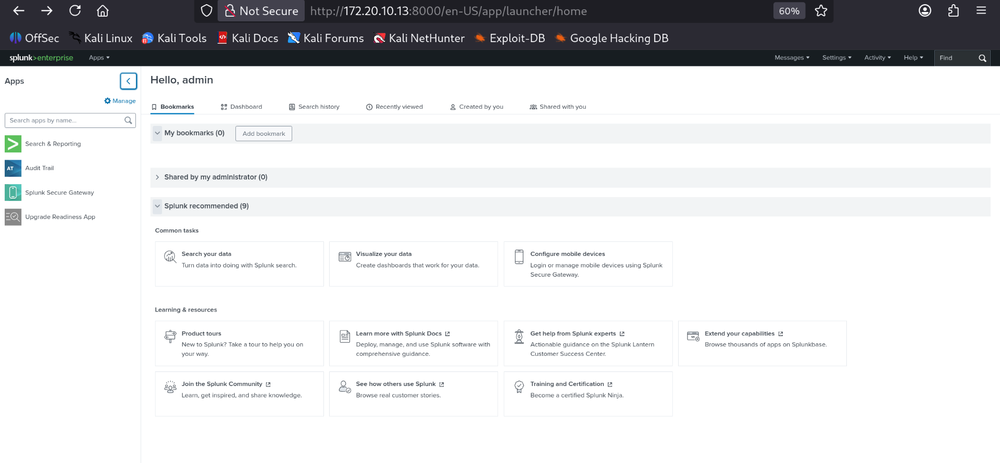
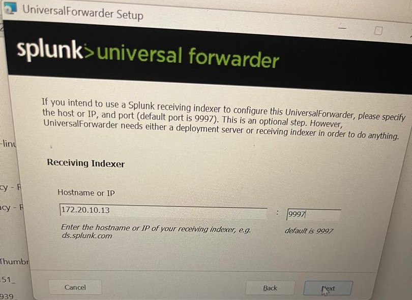
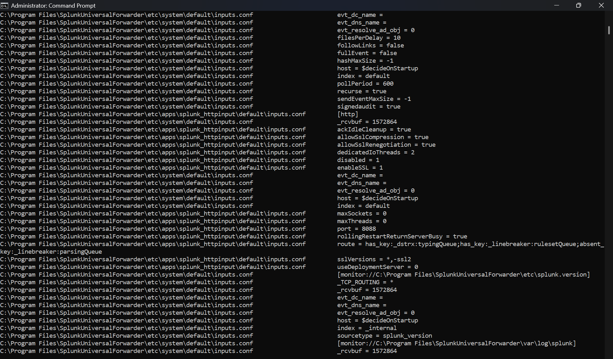
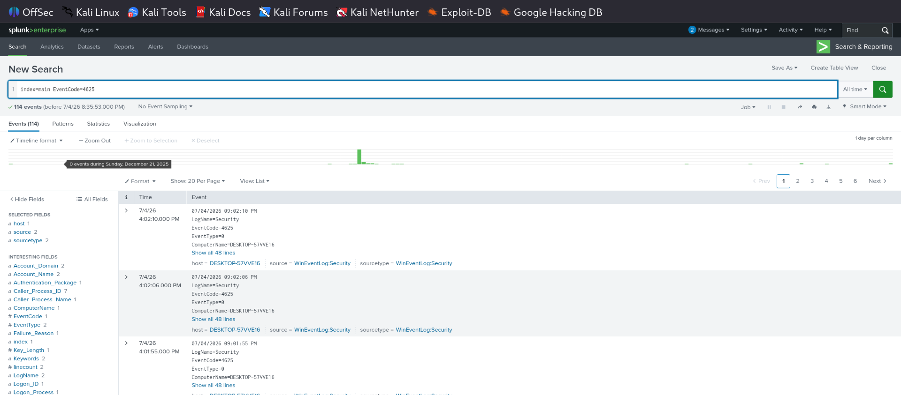
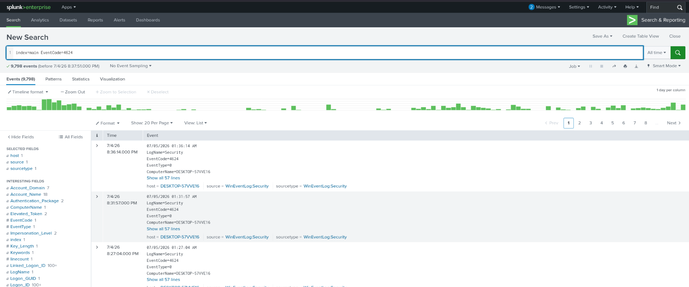
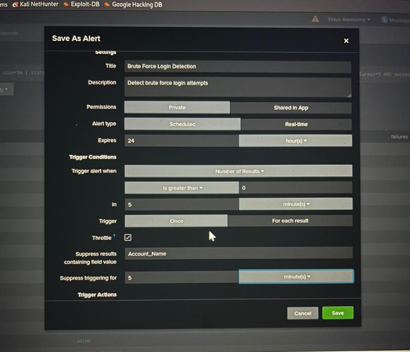
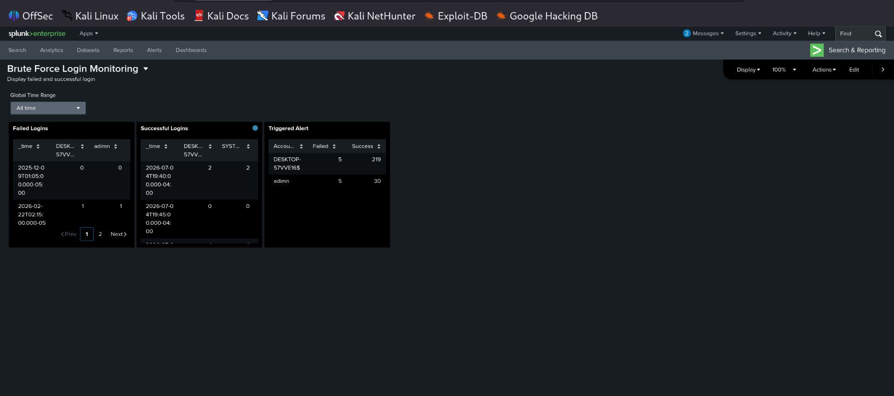

# Splunk Brute Force Login Detection using Splunk Enterprise

## Project Overview

This project demonstrates the design and implementation of a Security Information and Event Management (SIEM) solution using Splunk Enterprise to detect Windows brute force login attacks.

The environment consists of Splunk Enterprise running on Kali Linux as the SIEM server and Splunk Universal Forwarder installed on a Windows system to collect and forward Windows Event Logs.

The project focuses on detecting repeated failed login attempts, correlating successful logins, creating automated alerts, and visualizing security events through an interactive dashboard.

## Lab Environment

- SIEM Platform: Splunk Enterprise 9.4.8
- Operating System (SIEM): Kali Linux
- Endpoint: Windows
- Log Source: Windows Event Logs
- Forwarder: Splunk Universal Forwarder
- Log Types:
  - Security
  - System
  - Application

## Project Objectives

- Configure Splunk Enterprise as a SIEM platform.
- Collect Windows Event Logs.
- Detect brute force login attempts.
- Correlate failed and successful logins.
- Create automated alerts.
- Build a monitoring dashboard.
  ---

# Project Implementation

## 1. Installed Splunk Enterprise on Kali Linux

- Downloaded and installed Splunk Enterprise 9.4.8 on Kali Linux.
- Started the Splunk service.
- Accessed the Splunk Web interface.
- Completed the initial administrator setup.



---

## 2. Installed Splunk Universal Forwarder on Windows

- Installed Splunk Universal Forwarder.
- Configured the receiving indexer (Splunk Enterprise server) IP address.
- Configured port **9997**.
- Created the administrator account.



---

## 3. Configured Windows Event Log Collection

Configured Splunk Universal Forwarder to collect:

- Security Logs
- System Logs
- Application Logs

using the **inputs.conf** configuration.

Verified the configuration using:

```bash
splunk btool inputs list --debug
```

Restarted the forwarder after configuration.



---

## 4. Verified Log Ingestion

Confirmed that Windows Event Logs were successfully indexed inside Splunk Enterprise.

Example searches included:

```spl
index=main EventCode=4625
```

```spl
index=main EventCode=4624
```

These searches confirmed that authentication events were being collected successfully.





---

# Detection Logic (SPL Queries)

The following SPL queries were used to detect authentication events and identify potential brute force login attacks.

## Failed Login Attempts (Event ID 4625)

```spl
index=main EventCode=4625
```

Purpose:

- Retrieves failed Windows authentication attempts.
- Used to identify repeated failed logins that may indicate a brute force attack.


---

## Successful Login Events (Event ID 4624)

```spl
index=main EventCode=4624
```

Purpose:

- Retrieves successful Windows logins.
- Used to correlate successful logins following multiple failed attempts.


---

## Correlation Analysis

The failed login events (4625) and successful login events (4624) were analyzed together to identify suspicious authentication patterns that may indicate a successful brute force compromise.

This logic was later used to create alerts and populate the monitoring dashboard.

---

# Alert Configuration

To automate brute force detection, a Splunk alert was created based on failed authentication events.

## Alert Details

- Alert Name: Brute Force Login Detection
- Alert Type: Scheduled
- Trigger Condition: Number of Results > 0
- Time Window: 5 minutes
- Trigger Frequency: Once
- Throttling: Enabled (5 minutes)

The alert automatically notifies when suspicious authentication activity is detected within the configured threshold.



---

# Dashboard

An interactive dashboard was created to provide real-time visibility into authentication events and potential brute force attacks.

The dashboard includes:

- Failed Login Events
- Successful Login Events
- Triggered Alert Summary

The dashboard enables security analysts to quickly identify suspicious authentication activity and investigate potential brute force attacks.



---

# Project Results

The SIEM solution successfully detected and monitored Windows authentication events in real time.

The project achieved the following:

- Successfully collected Windows Security, System, and Application logs.
- Detected failed login attempts using Windows Event ID 4625.
- Identified successful logins using Windows Event ID 4624.
- Correlated failed and successful authentication events.
- Generated automated alerts for suspicious authentication activity.
- Displayed security events through an interactive Splunk dashboard.
  
---

- # Skills Demonstrated

- SIEM Implementation
- Splunk Enterprise Administration
- Splunk Universal Forwarder Configuration
- Windows Event Log Analysis
- Log Collection and Ingestion
- SPL (Splunk Processing Language)
- Threat Detection
- Brute Force Attack Detection
- Alert Configuration
- Dashboard Development
- Security Monitoring
  
---

  # Conclusion

This project demonstrates my ability to deploy and configure Splunk Enterprise as a SIEM platform, collect Windows Event Logs, develop SPL queries, configure automated alerts, and build dashboards for security monitoring and brute force attack detection.

The project provided practical experience in log management, threat detection, and Security Operations Center (SOC) workflows using Splunk Enterprise.
